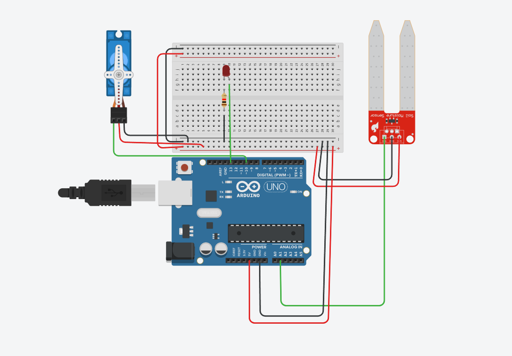

# Sistema Automático de Riego con Sensor de Humedad y Arduino

## Integrantes

* Matias Villero

---

# Descripción del Proyecto

Este proyecto consiste en un sistema automático de riego que monitorea la humedad del suelo mediante un sensor de humedad conectado a un Arduino Uno.

Cuando el nivel de humedad del suelo desciende por debajo de un valor establecido, el Arduino activa un servomotor que simula la apertura de una válvula de riego. Al mismo tiempo, un LED indica visualmente que el sistema se encuentra regando.

Una vez que el suelo alcanza un nivel adecuado de humedad, el sistema desactiva el riego y regresa al estado de monitoreo.

---

# Problema Identificado

En jardines, huertos domésticos y pequeños cultivos, el riego suele realizarse manualmente, lo que puede generar problemas como:

* Exceso de agua.
* Falta de agua para las plantas.
* Desperdicio de recursos hídricos.
* Dependencia de la supervisión constante del usuario.

La automatización del riego permite optimizar el uso del agua y mantener condiciones adecuadas para el crecimiento de las plantas.

---

# Objetivo General

Diseñar e implementar un sistema automático de riego capaz de monitorear la humedad del suelo y activar el riego cuando sea necesario mediante el uso de sensores y actuadores controlados por Arduino.

---

# Objetivos Específicos

* Medir la humedad del suelo utilizando un sensor de humedad.
* Procesar las lecturas mediante un Arduino Uno.
* Activar un servomotor cuando la humedad esté por debajo del umbral establecido.
* Utilizar un LED para indicar el estado de funcionamiento del sistema.
* Validar el funcionamiento mediante pruebas experimentales.

---

# Componentes Utilizados

| Componente                 | Cantidad | Función                                    |
| -------------------------- | -------- | ------------------------------------------ |
| Arduino Uno                | 1        | Controlador principal                      |
| Sensor de humedad de suelo | 1        | Medición de humedad                        |
| Servomotor SG90            | 1        | Simulación de apertura y cierre de válvula |
| LED rojo                   | 1        | Indicador visual del estado del sistema    |
| Resistencia 220 Ω          | 1        | Protección del LED                         |
| Protoboard                 | 1        | Conexiones temporales                      |
| Cables de conexión         | Varios   | Interconexión de componentes               |
| Cable USB                  | 1        | Alimentación y programación                |

---

# Arquitectura del Sistema

```text
Sensor de Humedad
         ↓
     Arduino Uno
         ↓
 ┌───────────────┐
 ↓               ↓
Servomotor      LED
(Válvula)   (Indicador)
```

---

# Conexiones del Circuito

## Sensor de Humedad

| Sensor | Arduino |
| ------ | ------- |
| VCC    | 5V      |
| GND    | GND     |
| SIG    | A0      |

## Servomotor

| Servo                 | Arduino       |
| --------------------- | ------------- |
| Rojo (VCC)            | 5V            |
| Negro/Marrón (GND)    | GND           |
| Verde/Naranja (Señal) | Pin Digital 9 |

## LED

| LED        | Arduino                 |
| ---------- | ----------------------- |
| Ánodo (+)  | Pin Digital 13          |
| Cátodo (-) | Resistencia 220 Ω → GND |

---

# Funcionamiento

1. El sensor de humedad mide continuamente las condiciones del suelo.
2. El Arduino recibe la lectura a través del pin analógico A0.
3. El programa compara el valor obtenido con un umbral de humedad previamente definido.
4. Si el suelo está seco:

   * El servomotor gira para abrir la válvula de riego.
   * El LED se enciende indicando que el sistema está regando.
5. Si el suelo tiene suficiente humedad:

   * El servomotor vuelve a la posición de cierre.
   * El LED permanece apagado.
6. El proceso se repite continuamente.

---

# Diagrama de Flujo

```text
Inicio
   ↓
Leer Sensor
   ↓
¿Suelo seco?
 ┌───────┴────────┐
 Sí              No
 ↓                ↓
Abrir Servo    Mantener Cerrado
Encender LED   Apagar LED
 ↓                ↓
Monitorear continuamente
```

---

# Imagen del Circuito



---

# Código Fuente


El programa realiza las siguientes funciones:

* Lectura del sensor de humedad.
* Comparación con un umbral definido.
* Control del servomotor.
* Activación del LED indicador.
* Monitoreo continuo del estado del sistema.

---

# Pruebas Realizadas

| Prueba                  | Descripción                                      | Resultado |
| ----------------------- | ------------------------------------------------ | --------- |
| Lectura del sensor      | Medición en suelo seco y húmedo                  | Correcta  |
| Control del servomotor  | Movimiento según nivel de humedad                | Correcto  |
| Encendido del LED       | Indicación visual del riego                      | Correcto  |
| Integración del sistema | Funcionamiento conjunto de todos los componentes | Correcto  |

---

# Estado Actual del Proyecto

✅ Diseño completado

✅ Programación implementada

🔄 Posibles mejoras futuras

---

# Dificultades Encontradas

* Variaciones en las lecturas del sensor de humedad.
* Ajuste del valor umbral para determinar cuándo activar el riego.
* Calibración de la posición del servomotor para simular correctamente la apertura y cierre de la válvula.

---

# Mejoras Futuras

* Implementar una bomba de agua real.
* Sustituir el servomotor por una electroválvula.
* Incorporar monitoreo remoto mediante WiFi.
* Registrar datos históricos de humedad.
* Agregar sensores de temperatura y humedad ambiental.
* Implementar alimentación mediante paneles solares.

---

# Conclusiones

Este proyecto permitió desarrollar un sistema automático de riego utilizando Arduino, sensores y actuadores. Se comprobó que es posible monitorear continuamente la humedad del suelo y activar automáticamente el riego cuando las condiciones lo requieren.

Además, el proyecto demuestra cómo la automatización puede contribuir al ahorro de agua, la reducción de la intervención humana y el mantenimiento adecuado de las plantas mediante tecnologías de bajo costo.
